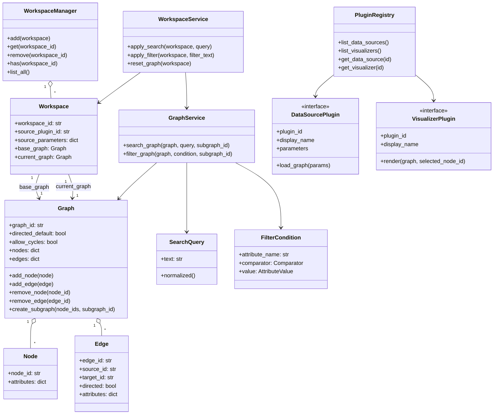

# Class Diagram

```mermaid
classDiagram
    class Graph {
        +graph_id: str
        +directed_default: bool
        +allow_cycles: bool
        +nodes: dict
        +edges: dict
        +add_node(node)
        +add_edge(edge)
        +remove_node(node_id)
        +remove_edge(edge_id)
        +create_subgraph(node_ids, subgraph_id)
    }

    class Node {
        +node_id: str
        +attributes: dict
    }

    class Edge {
        +edge_id: str
        +source_id: str
        +target_id: str
        +directed: bool
        +attributes: dict
    }

    class Workspace {
        +workspace_id: str
        +source_plugin_id: str
        +source_parameters: dict
        +base_graph: Graph
        +current_graph: Graph
    }

    class WorkspaceManager {
        +add(workspace)
        +get(workspace_id)
        +remove(workspace_id)
        +has(workspace_id)
        +list_all()
    }

    class WorkspaceService {
        +apply_search(workspace, query)
        +apply_filter(workspace, filter_text)
        +reset_graph(workspace)
    }

    class GraphService {
        +search_graph(graph, query, subgraph_id)
        +filter_graph(graph, condition, subgraph_id)
    }

    class SearchQuery {
        +text: str
        +normalized()
    }

    class FilterCondition {
        +attribute_name: str
        +comparator: Comparator
        +value: AttributeValue
    }

    class DataSourcePlugin {
        <<interface>>
        +plugin_id
        +display_name
        +parameters
        +load_graph(params)
    }

    class VisualizerPlugin {
        <<interface>>
        +plugin_id
        +display_name
        +render(graph, selected_node_id)
    }

    class PluginRegistry {
        +list_data_sources()
        +list_visualizers()
        +get_data_source(id)
        +get_visualizer(id)
    }

    Graph "1" o-- "*" Node
    Graph "1" o-- "*" Edge
    Workspace "1" --> "1" Graph : base_graph
    Workspace "1" --> "1" Graph : current_graph
    WorkspaceManager "1" o-- "*" Workspace
    WorkspaceService --> Workspace
    WorkspaceService --> GraphService
    GraphService --> Graph
    GraphService --> SearchQuery
    GraphService --> FilterCondition
    PluginRegistry --> DataSourcePlugin
    PluginRegistry --> VisualizerPlugin
```
